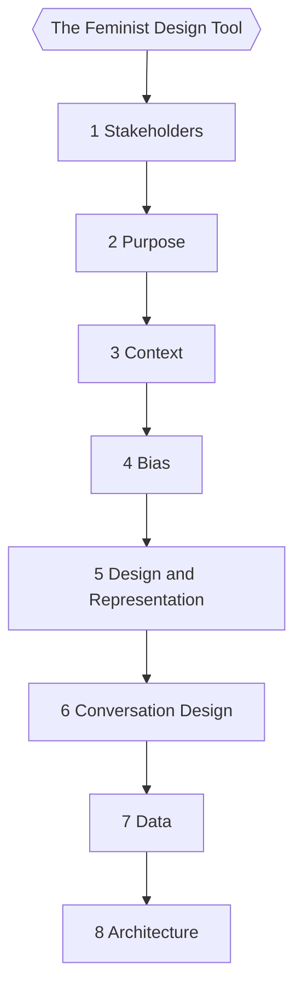

# Tools for a Feminist Bot

1. [[1 Stakeholders]]
2. [[2 Purpose]]
3. [[3 Context]]
4. [[4 Bias]]
5. [[5 Design and Representation]]
6. [[6 Conversation Design]]
7. [[7 Data]]
8. [[8 Architecture]]

