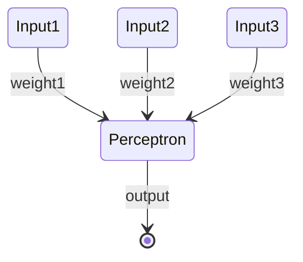

### perceptron

Go back to the [[AI Glossary]]

A system (either hardware or software) that takes in one or more input values, runs a function on the weighted sum of the inputs, and computes a single output value. In machine learning, the function is typically nonlinear, such as ReLU, sigmoid, or tanh. For example, the following perceptron relies on the sigmoid function to process three input values:

In the following illustration, the perceptron takes three inputs, each of which is itself modified by a weight before entering the perceptron:

A perceptron that takes in 3 inputs, each multiplied by separate weights. The perceptron outputs a single value.

Perceptrons are the (nodes) in deep neural networks. That is, a deep neural network consists of multiple connected perceptrons, plus a backpropagation algorithm to introduce feedback.

