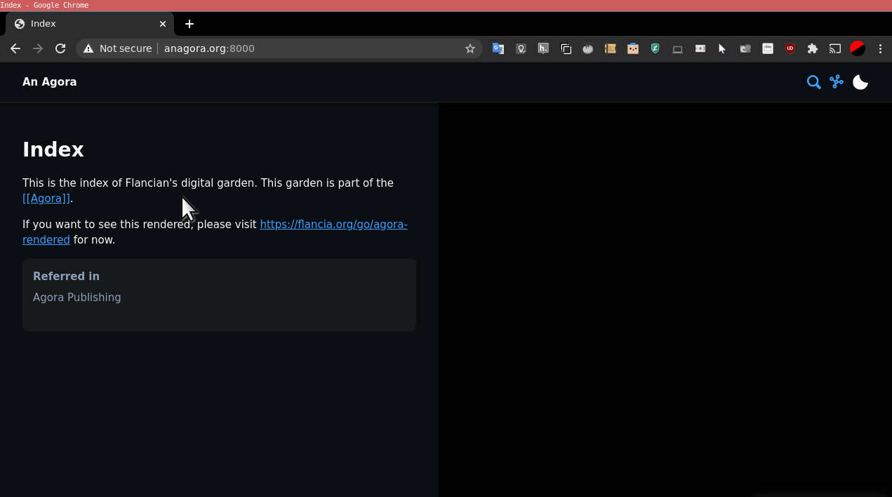

# Welcome to the Agora v0.5
This is v0.5 of the [Agora](flancia.org/agora). You can find the v0 online (but currently in maintenance mode only) at https://anagora.org/wiki; this Agora v0.5 repository is expected to replace it eventually.

# What's an Agora?

An [Agora](https://anagora.org/wiki/Agora) is a distributed, goal-oriented social network centered around a cooperatively built and maintained knowledge graph. The implementation you are currently looking at tries to assemble such a graph out of a collection of [digital gardens](https://joelhooks.com/digital-garden).

The Agora is also a narrative: the Agora is a virtual place assembled from intereting fragments of our internet. This repository points to many such places. Feel free to explore and have fun!

## Who builds the Agora?

The *Agoreans* build the Agora. 

Anybody can become an Agorean: you just need to be interested in building or maintaining an Agora, and willing to uphold and preserve its Contract.

## Contract
Please refer to [[CONTRACT]].

***If you contribute directly to an Agora you are assumed to be in agreement with its then current Contract.*** 

If you disagree with any item in the Contract, or would like to improve it, please send a PR. You can also, of course, fork the Agora anytime for any reason. In this way you gain full control over its Contract, although not over its users and existing places: you are in effect creating a new Agora.

# Places in this Agora

 - [Gardens](garden/): here you'll find a collection of [digital gardens](https://joelhooks.com/digital-garden), or personal knowledge bases, from around the internet (currently being built, starting with those of the Agoreans).
   - [flancian's digital garden](garden/flancian/README).
 - [Stoas](stoa/): subspaces built by groups of Agoreans in which participating users actively seek to engage in meaningful, constructive, civil, charitable discussion (planned).
