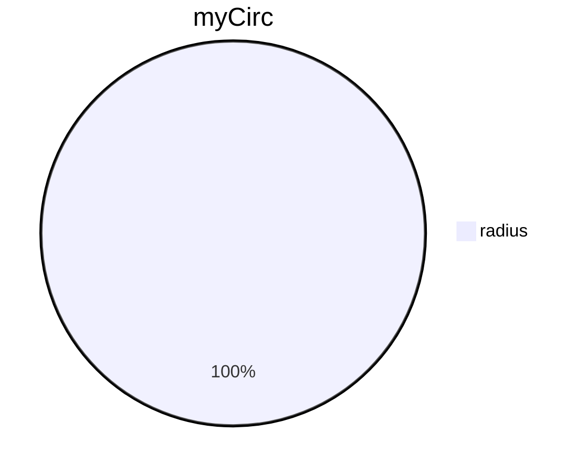

# Python Classes
Go to the [[Python Week 3 Main Page]] or the [[Python - Main Page]]
Also see the [[Programming Main Page]] or the [[Main AI Page]]

For code examples see the [[Week3 Classes and Objects Lab]]

#oop #classes #programming #TensorFlow #data 

>Classes are objects, and in Python, every object has a:
> - Type
> - Internal data representation (a blueprint)
> - Methods (a set of procedures for interacting with or manipulating the object)

==An object is an instance of a particular type.== <-- It sounds like they're using class/type interchangebly.


This is where the `type()` function comes into play. It returns what ==type== or ==class== something is.

**note**

A class does not need to have a constructor, and classes built without one can still have class variables and methods, but cannot take arguments to set those variable's values at initialisation.

A class's methods are functions the every instance of that class's objects provide. It's how you interact with the data in the object.

For example, the elements in a list or the key-value pairs in a dictionary.

`sc_members.sort()` <-- `sort()` is a method of the class ==list== to which sc_members belongs. 

## Defining your own class

The structure of a class:


### Syntax

`class Name_of_class(parent_class ):`

#### __init__()

To create your class, you must initialise its data and method structure first. This includes declaring the Class as above and initialising its data blueprint with the `__init__()` function.


The anatomy of a the `__init__()` class constructor is especially important, and other 'dunder' functions exist to create more complex classes. This one is required for all classes.


## Attributes

An example: Creating a class for a circle and a rectangle.

Class Circle:

```python
class Circle(object ):
	def __init__(self, radius, colour):
		self.radius = radius
		self.colour = colour
```

- Data Attributes
	- Radius
	- Colour

Class Rectangle

```python
class Rectangle(object ):
	def __init__(self, height, width, colour):
		self.height = height
		self.width = width
		self.colour = colour
```

- Data Attributes
	- Height
	- Width
	- Colour

### Creating an instance of a class:

Creating an instance of the class is as simple as calling the class initialiser function, but in place of `__init__()` you use the name of the class.

`instance = classname(attribute1, attribute2)`

E.g.

`myCirc = Circle(12, "red")`

### Accessing class self parameters/attributes

Say you want to know what the circle's radius or colour is. You simply use ==dot notation==

---> print(myCirc.radius)
---> 12
---> print(myCirc.colour)
---> "red"

### Changing attributes

You can set the value of an object's attribute with the assignment operator `=` directly.

`myCirc.radius = 12`

`myRec.colour = 'racing_green'`

## Class Variables Vs Instance Variables

Classes can have two types of variables, class variables and instance variables.

- **Class variables** or private variables are those that have values inherent to the class, such as a car class having **4** wheels or having a **vehicle** legal type. 
- **Instance variables** or public variables are variables specific to that instance, such as a car class being a **Mercedes** make and a **C30** model.

Class variables are declared straight away beneath the docstring while instance variables are created in the initialisation function, `__init__()`. See the syntax below.

```python
Class CarObject(object ):
"""
A representation of a car
"""
	wheels = 4
	chassis = 1
	engines = 1
	legal_type = "vehicle"
	
	def __init__(self, make, model, registration)
		self.make = make
		self.model = model
		self.registration = registration

my_car = CarObject("Mercedes", "C30", "FARQ2")

# Accessing a Class variable

CarObject.engines = 2

# Accessing an Instance variable

my_car.registration = "TK421"

# but also ...

my_car.legal_type = "vehicle"

# though not ...

CarObject.make <-- This would throw an error

```

## Methods

Methods are functions built into an object. They manipulate, populate, and help interact with the object.


### Syntax

```python
class Circle(object ):
	def __init__(self, radius, colour):
		self.radius = radius
		self.colour = colour
	
	def add_radius(self, r):
		self.radius = self.radius + r
	
	def reduce_radius(self, r):
		if self.radius - r > 0:
			self.radius = self.radius - r
		else:
			print("Circles must have a positive radius.")
	
	def drawCircle(self):
		pass
```

`myCirc = Circle(12, "racing_green"`

myCirc.radius
--> 12
myCirc.colour
--> "racing_green"
mycirc.drawCircle()


### The 'dir()' function

The `dir()` function, when passed the name of an object, will show you the attributes and methods of the object. 

